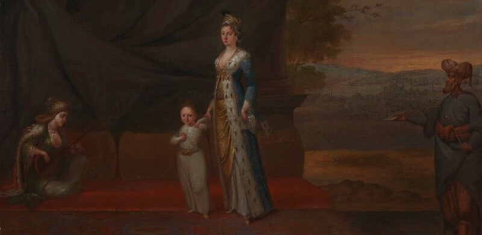

# Python Programming for Multilingual Texts
*The Letters of Lady Montagu*

<small>Lady Mary Wortley Montagu with her son, Edward Wortley Montagu, and attendants. Jean Baptiste Vanmour, ca. 1717. National Portrait Gallery, London, UK.</small>

What does it take to turn a historical text into data? How can we productively apply contemporary computational methods to historical texts? What do these methods reveal that we could not have found by reading the sources alone? And what happens when we apply the same methods to two versions of the same text in two different languages? What does working across two languages tell us about the methods themselves? This course uses one of the richest epistolary corpora of the 18th century, Lady Mary Wortley Montagu (1689-1762)’s Turkish Embassy Letters, operationalizing every stage of a digital history project: From archival sources to text extraction, from raw data to research questions, from computational analysis to visualization and interpretation, and machine translation.

## Introduction

This course introduces digital history through multilingual text analysis using Python and Jupyter Notebooks. Participants will complete a full digital history project, from sourcing primary materials to analysis and visualization. The course corpus will be Lady Montagu’s Turkish Embassy Letters, detailing her travels to Constantinople (1716-18), from the parallel English-French 1816 edition. Participants will learn to clean, analyze, and visualize multilingual data in Python, and examine how text technologies and analytical techniques differ across source languages. They will also experiment with machine translation. No prior experience with digital tools is required, though an interest in historical source analysis is encouraged.

### Learning Goals

This course introduces Python fundamentals, data manipulation and visualization, and natural language processing (NLP) tasks like part-of-speech tagging, named entity recognition, and machine translation. Applying these methods to the same corpus allows each unit to build on the last, giving participants a cumulative, end-to-end understanding of what digital history projects look like in practice. Working with the 1816 bilingual edition of Turkish Embassy Letters, participants will also develop a comparative perspective on how computational methods behave across languages. By the end of this course, participants will have a working knowledge of Python and the tools to design their own multilingual text analysis project, including how to work with machine translation and large language model APIs. 

## Historical Context

### Who was Lady Montagu?

Lady Mary Wortley Montagu (1689–1762) was an English aristocrat, writer, and poet. Largely self-educated, she was already a prolific writer by her early teens. In 1712, she eloped with Edward Wortley Montagu, and accompanied him four years later when he was appointed ambassador to Constantinople. For two years between 1716 and 1718, she traveled through Eastern and Southeastern Europe into the Ottoman Empire, and finally to Adrianople and Constantinople. These travels would define her legacy. Her letters from this period, later published posthumously as Turkish Embassy Letters, offer a vivid and unusually intimate account of Ottoman society, written by someone whose gender gave her access to spaces closed off to male travelers. She is also celebrated for introducing smallpox inoculation to Britain after witnessing the practice in the Ottoman Empire. She had her own children inoculated and campaigned publicly for the procedure at a time when it was deeply controversial. After returning to England she remained a prominent figure in literary and court society, before spending the last two decades of her life traveling and writing across Italy and France. She died in London in 1762.

### Turkish Embassy Letters

The Turkish Embassy Letters, published posthumously in 1763 and semi-anonymously with the title “Letters of the Right Honorable Lady M--y W--y M--e: written during her travels in Europe, Asia and Africa to persons of distinction”, contain letters written by Lady Mary Wortley Montagu during her travels to Constantinople (1716–18). A landmark text in the study of Early Modern travel, gender, and cultural exchanges between Europe and the Ottoman Empire, they also hold an important place in history pedagogy, appearing on almost every English-language syllabus dealing with the Early Modern Ottoman Empire. Their popularity is not a recent phenomenon. Already in the 18th century they were widely read and admired by Enlightenment figures like Voltaire and Gibbon. They were also quickly translated into multiple languages, including French in 1764. Today, multiple scholarly and open-access editions exist, including one freely available on Project Gutenberg, alongside an extensive secondary literature.

The history of these letters and how they have been perceived and studied in scholarship is in and of itself interesting. In the 18th century, they were a curiosity. The advertisement of the work emphasized how Lady Montagu gained access to women’s spaces in the Ottoman Empire and thus shared insights that male travellers at the time could not. Later scholarship celebrated both Montagu and her exceptional legacy as a woman traveller. She was one of the few women on the Grand Tour that was able to make a name for herself. Unlike the Orientalist men who depicted the ‘Orient’ as backwards and static, Lady Montagu offered a feminist narrative, identifying with and humanizing Muslim women for Western audiences. More recent scholarship, however, emphasizes a different dynamic. Scholars have argued that Montagu's letters, despite their apparently sympathetic tone, cannot be disentangled from the broader apparatus of Orientalism. Her unique access to women's spaces positioned her writing as a supplement to the male Orientalist tradition, filling in what men could not see, while ultimately serving the same desire to know and possess the "hidden" Orient. Her rhetoric of identification with Ottoman women, rather than placing her outside Orientalism, may itself be an Orientalizing gesture that translates difference into sameness on Western terms. Others have questioned the very image of Montagu as a singular, pioneering female traveler, pointing to the network of servants, interpreters, and possibly slaves who made her journey possible but who are systematically erased from her letters. These debates, around Orientalism, gender, class, and the limits of a feminist reading of the text, are now central to the scholarship, and make the Turkish Embassy Letters a particularly rich and contested object of study.

This course uses the Turkish Embassy Letters not as a canonical text to be celebrated, but as a convenient and richly debated starting point. Its popularity in scholarship, its availability in multiple editions and languages, and its long historiographical afterlife make it an ideal corpus for learning the tools of computational text analysis, while keeping questions of historical interpretation, positionality, and critical reading firmly in view.

## Digital History

### What is digital history?

Digital history applies computational methods to historical sources and questions. Rather than replacing traditional historical analysis, it extends what is possible by allowing historians to work across large corpora, identify patterns invisible in traditional source analysis, and ask new kinds of questions about the past. Digital history as a field extends well beyond text analysis. Historical geographic information systems, network analysis, and data visualization are just a few of the other methods historians have used to explore the past computationally. This course, however, focuses on historical and multilingual text analysis, drawing on methods from natural language processing, corpus linguistics, and machine learning, applying them to a historical text. The course materials introduce both the practical tools and the broader debates: About what is lost when historical texts are digitized and processed, how computational methods behave on noisy or non-standard historical language, and what it means to do this work critically and responsibly.

## Course Plan

### Unit 1: Introduction

This unit introduces the Python coding language and our text corpus. We start with Python fundamentals, covering the basics of the language with an eye toward what is most useful for text analysis. We then get to know the Turkish Embassy Letters through the English Gutenberg edition, discussing how historical texts are transformed into digital corpora and the decisions that go into that process. We also work with the 1764 French edition of the letters, using it as an occasion to learn about text recognition and the challenges of digitizing historical texts.

**Readings**

Grundy, Isobel. "Montagu, Lady Mary Wortley [née Lady Mary Pierrepont] (bap. 1689, d. 1762), writer." Oxford Dictionary of National Biography. 23 Sep. 2004; Accessed 31 Mar. 2026. https://www.oxforddnb.com/view/10.1093/ref:odnb/9780198614128.001.0001/odnb-9780198614128-e-19029.

Heffernan, Teresa, and Daniel O’Quinn. "Introduction." In The Turkish Embassy Letters, by Lady Mary Wortley Montagu, eds. Teresa Heffernan and Daniel O’Quinn, 11–34. Peterborough, ON: Broadview Press, 2013.

Prescott, Andrew. "Searching for Dr. Johnson: The Digitization of the Burney Newspaper Collection." In Travelling Chronicles: News and Newspapers from the Early Modern Period to the Eighteenth Century, 51-71. Edited by Siv Gøril Brandtzæg, Paul Goring, and Christine Watson. Leiden, Boston: Brill, 2018.

Cordell, Ryan. "‘Q i-jtb the Raven’: Taking Dirty OCR Seriously." Ryan C. Cordell (blog). January 7, 2016. https://ryancordell.org/research/qijtb-the-raven-mla/.

### Unit 2: Counting Words

This unit introduces key libraries for text analysis and working with data in Python, including pandas and NLTK, and asks a deceptively simple question: What can we learn by counting words? We explore how to structure textual data, how and why to remove stopwords, and what word frequencies can and cannot tell us about a historical corpus. Running the same analysis on the French edition, we begin to examine how language shapes computational results.

**Readings**

Underwood, Ted. "Seven Ways Humanists Are Using Computers to Understand Text." The Stone and the Shell (blog), June 4, 2015. https://tedunderwood.com/2015/06/04/seven-ways-humanists-are-using-computers-to-understand-text/.

Turkel, William J., and Adam Crymble. "Counting Word Frequencies with Python." Programming Historian (2012). https://doi.org/10.46430/phen0003.

Jurafsky, Daniel, and James H. Martin. "Words and Tokens." In Speech and Language Processing: An Introduction to Natural Language Processing, Computational Linguistics, and Speech Recognition with Large Language Models. 3rd ed. Online manuscript, released January 6, 2026. https://web.stanford.edu/~jurafsky/slp3/2.pdf.
> Alternatively or additionally, you can watch the relevant lectures from Dan Jurafsky's CS 124: From Languages to Information, Stanford University: https://www.youtube.com/channel/UC_48v322owNVtORXuMeRmpA

### Unit 3: Natural Language Processing Pipelines

This unit moves from counting to parsing, introducing NLP pipelines for part-of-speech tagging, lemmatization, and dependency parsing. We work with both traditional statistical models and the neural pipeline Stanford Stanza, and pay particular attention to how these tools perform on historical and non-standard language. The French edition again serves as a comparative lens for our discussion of methods.

**Readings**

Bamman, David. "Natural Language Processing for the Long Tail." Paper presented at Digital Humanities 2017, Montreal, Canada, August 8–11, 2017. https://people.ischool.berkeley.edu/~dbamman/pubs/pdf/dh2017.pdf.

Yang, Yi, and Jacob Eisenstein. "Part-of-Speech Tagging for Historical English." In Proceedings of the 2016 Conference of the North American Chapter of the Association for Computational Linguistics: Human Language Technologies, edited by Kevin Knight, Ani Nenkova, and Owen Rambow, 1318–1328. San Diego, California: Association for Computational Linguistics, 2016. www.aclweb.org/anthology/N16-1157.

Qi, Peng, Yuhao Zhang, Yuhui Zhang, Jason Bolton, and Christopher D. Manning. "Stanza: A Python Natural Language Processing Toolkit for Many Human Languages." In Proceedings of the 58th Annual Meeting of the Association for Computational Linguistics: System Demonstrations, edited by Asli Celikyilmaz and Tsung-Hsien Wen, 101–108. Online: Association for Computational Linguistics, 2020. https://aclanthology.org/2020.acl-demos.14/

Szawerna, Maria Irena. "Can Stanza be Used for Part-of-Speech Tagging Historical Polish?" In Proceedings of the 18th Conference of the European Chapter of the Association for Computational Linguistics: Student Research Workshop, edited by Neele Falk, Sara Papi, and Mike Zhang, 44–49. St. Julian’s, Malta: Association for Computational Linguistics, 2024. https://aclanthology.org/2024.eacl-srw.4/

### Unit 4: Vectors and NER

This unit asks how words can be represented numerically and what we can do with those representations. We experiment with word embeddings and introduce Named Entity Recognition as a method for annotating the corpus. We examine where NER succeeds and where it fails on historical text, before applying it to a concrete task: Mapping the places mentioned in the letters and comparing the results with metadata-based mapping.

**Readings**

McDonough, Katherine, Ludovic Moncla, and Matje van de Camp. 2019. “Named Entity Recognition Goes to Old Regime France: Geographic Text Analysis for Early Modern French Corpora.” International Journal of Geographical Information Science 33 (12): 2498–2522. doi:10.1080/13658816.2019.1620235.

Blankenship, Avery, Sarah Connell, and Quinn Dombrowski. "Understanding and Creating Word Embeddings." Programming Historian 13 (2024). https://doi.org/10.46430/phen0116.

### Unit 5: Machine Translation and Artificial Intelligence

This unit uses the 1816 bilingual French-English edition of the letters as the basis for a machine translation experiment. We work with neural machine translation models and use API calls to a large language model to prompt it for translation tasks. The unit also serves as a broader introduction to machine learning and artificial intelligence: What it means to train, evaluate, and fine-tune a model, and what the stakes of these choices are when working with historical and low-resource languages.

**Readings**

Murgia, Madhumita and Visual Storytelling Team. "Generative AI exists because of the transformer." Financial Times, September 12, 2023. https://ig.ft.com/generative-ai/.

Nekoto, Wilhelmina, et al. "Participatory Research for Low-resourced Machine Translation: A Case Study in African Languages." Findings of the Association for Computational Linguistics: EMNLP, 2020. https://aclanthology.org/2020.findings-emnlp.195/

Tekgürler, Merve. "LLMs for Translation: Historical, Low-Resourced Languages and Contemporary AI Models." In Proceedings of the 9th Joint SIGHUM Workshop on Computational Linguistics for Cultural Heritage, Social Sciences, Humanities and Literature (LaTeCH-CLfL 2025), edited by Anna Kazantseva, Stan Szpakowicz, Stefania Degaetano-Ortlieb, Yuri Bizzoni, and Janis Pagel, 227–237. Albuquerque, New Mexico: Association for Computational Linguistics, 2025. https://aclanthology.org/2025.latechclfl-1.20/.

